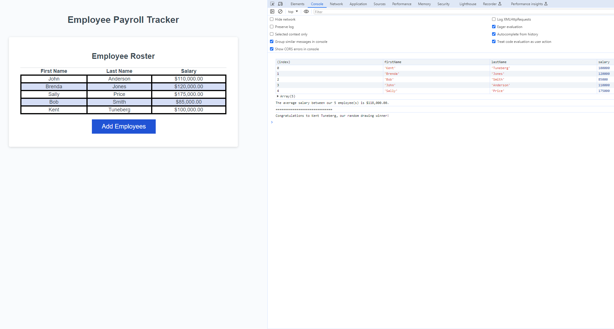

# Employee Payroll Tracker

## Description

This is a project for UW bootcamp in which we add functions to a payroll tracker to make it function

## Installation

N/A

## Usage

On clicking the "Add Employees" button, the user will be prompted for the first name, last name and salary of an employee. Anything that is not a number entered in the salary will default it to 0. The user will then be asked if they would like to enter another employee, and this will loop until the user clicks cancel. The employee data is then organized and the console will return the average salary of the employees and pick one random employee to win a drawing.

Link to deployed application: https://ktunebe.github.io/challenge-03-payroll-tracker/

## Credits

N/A

## License

N/A